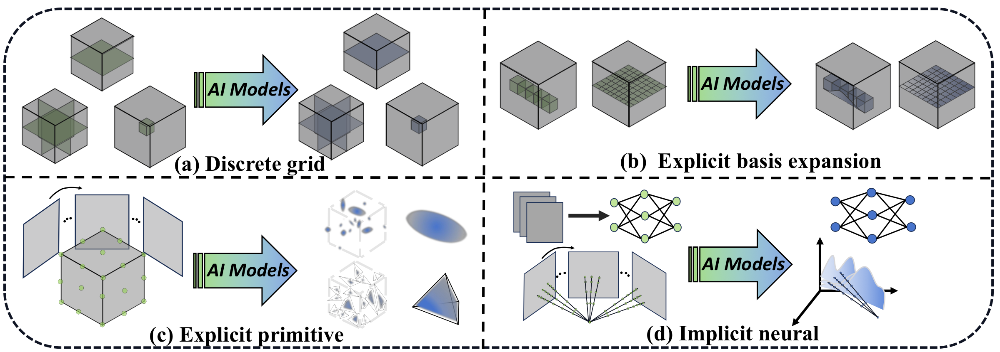
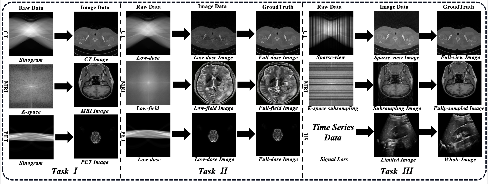

# AI4Radiology

[](https://awesome.re)
[](#methods)
[](#datasets)
[](#methods)
[](LICENSE)
[](https://github.com/Bean-Young/AI4Radiology/stargazers)

This project was created by [***Yuezhe Yang***](https://bean-young.github.io) for the paper **"Representation Paradigms in AI-based 3D Radiological Image Reconstruction: A Systematic Review"** ([Paper Link](https://arxiv.org/abs/2504.11349)).

## ***Contents***

- [Abstract](#abstract)
- [Highlights](#highlights)
- [Taxonomy](#taxonomy)
- [Datasets](#datasets)
- [Evaluation Metrics](#evaluation-metrics)
- [Methods](#methods)
- [Challenges and Opportunities](#challenges-and-opportunities)
- [Contributing](#contributing)
- [Citation](#citation)

## ***Abstract***

The demand for high-quality medical imaging in clinical practice and assisted diagnosis has made 3D reconstruction in radiological imaging a key research focus. Artificial intelligence (AI) has emerged as a promising approach for improving reconstruction accuracy while reducing acquisition and processing time, thereby minimizing patient radiation exposure and discomfort and ultimately benefiting clinical diagnosis. This review surveys state-of-the-art AI-based 3D reconstruction algorithms in radiological imaging and organizes them into four representation families according to how the reconstructed target is parameterized: discrete grid representations, explicit basis expansion representations, explicit primitive representations, and implicit neural representations. In particular, the review clarifies the relationships among these representation forms and highlights radiance field methods as a specialized subtype of implicit neural representation. In addition, we summarize commonly used evaluation metrics and benchmark datasets for radiological image reconstruction. Finally, we discuss the current state of development, major challenges, and future research directions in this rapidly evolving field. Our project is available at: [https://github.com/Bean-Young/AI4Radiology](https://github.com/Bean-Young/AI4Radiology).

## ***Highlights***

- **Representation-first organization.** Methods are grouped by how the reconstructed target is parameterized, not only by network backbone.
- **Paper + code links.** Each method row includes a paper page and a code link when a public implementation is available.
- **Radiology-focused scope.** The list centers on reconstruction and image formation across CT, MRI, PET, SPECT, ultrasound, and multi-modality settings.
- **Awesome-style maintenance.** PRs adding missing code, paper pages, datasets, or corrected metadata are welcome.

## ***Taxonomy***

| Family | Core idea | Typical strengths | Common limitations |
| --- | --- | --- | --- |
| Discrete grid | Reconstruct slices or volumes on regular pixels/voxels. | Simple, deployable, compatible with clinical image grids. | Fixed sampling can limit spatial continuity and memory efficiency. |
| Explicit basis expansion | Store finite coefficients over local bases, kernels, or transformed domains. | Interpretable coefficients and strong links to classical reconstruction. | Depends on basis/kernel design and imaging-operator conditioning. |
| Explicit primitive | Use adaptive primitives such as 3D Gaussians or meshes. | Efficient adaptive modeling and fast rendering potential. | Requires specialized initialization, rendering, and optimization. |
| Implicit neural | Model anatomy or measurements with continuous coordinate-query functions. | Strong continuous modeling under sparse-view or low-dose settings. | Expensive optimization and weaker interpretability. |

<p align="center">
  
</p>

<p align="center"><em>Taxonomy of representation families for AI-based 3D reconstruction in radiological imaging.</em></p>

## ***Datasets***

<p align="center">
  
</p>

<p align="center"><em>Three distinct task types in radiological image reconstruction.</em></p>

| Modality | Task | Dataset | Size | Details |
| --- | --- | --- | --- | --- |
| CT | Task I / Task II | [AAPM Low Dose CT Grand Challenge](https://www.aapm.org/grandchallenge/lowdosect/) | 30 abdominal cases plus an ACR phantom | A classic low-dose CT reconstruction benchmark providing quarter-dose and full-dose CT data for algorithm comparison under clinically relevant dose reduction. |
| CT | Task I / Task II | [LDCT-and-Projection-Data](https://doi.org/10.7937/9npb-2637) | 299 clinical CT examinations | A TCIA/Mayo dataset containing head, chest, and abdomen CT projection data in DICOM-CT-PD format, with routine-dose and simulated low-dose projections for CT reconstruction and denoising. |
| CT | Task I / Task II | [LoDoPaB-CT](https://lodopab.grand-challenge.org/) | 46,573 2D image-observation pairs | A large low-dose CT benchmark derived from LIDC-IDRI, providing simulated low-photon-count CT observations and ground-truth images for inverse reconstruction. |
| CT | Task I / Task III | [SinoCT](https://aimi.stanford.edu/datasets/sinoct) | >9,000 head CT scans | A large head CT dataset with reconstructed DICOM images and GE CatSim-simulated sinograms, suitable for sinogram-domain and reduced-projection CT reconstruction studies. |
| CT | Task II / Task III | [AAPM CT-MAR Challenge](https://www.aapm.org/GrandChallenge/CT-MAR/) | 14,000 training cases, 1,000 test cases, and 29 final clinical scoring cases | A CT metal artifact reduction benchmark providing paired metal-corrupted and metal-free images and sinograms, allowing image-domain, sinogram-domain, and hybrid reconstruction methods. |
| CT | Task I / Task III | [MORE](https://more-med.github.io/) | 135 CT studies (65,575 slices) | A multi-organ CT reconstruction benchmark covering 9 anatomies and 15 lesion types, designed for sparse-view CT reconstruction and cross-anatomy generalization evaluation. |
| CT | Task III | [Corona-Figueroa et al.](https://github.com/abrilcf/mednerf) | 25 CT volumes | A paper-specific chest and knee CT-to-DRR corpus used for single- or few-view X-ray/CT projection reconstruction and 3D-aware radiological novel-view synthesis. |
| MRI | Task I / Task III | [fastMRI](https://fastmri.med.nyu.edu/) | 1,594 knee raw scans, 7,002 brain raw scans, plus prostate and breast subsets | A large-scale MRI reconstruction benchmark releasing raw k-space and reference images for accelerated single-coil and multi-coil MRI reconstruction. |
| MRI | Task I / Task III | [Calgary-Campinas Public Brain MR Raw k-space Dataset](https://sites.google.com/view/calgary-campinas-dataset/home) | 167 3D T1-weighted brain MRI scans | A public brain MRI raw k-space benchmark with 12-channel and 32-channel acquisitions for accelerated 3D MRI reconstruction. |
| MRI | Task I / Task III | [OCMR](https://ocmr.info/) | 165 fully sampled and 212 prospectively undersampled cardiac cine series | An open-access cardiac MRI dataset providing multi-coil k-space data for fully sampled and prospectively undersampled cine reconstruction. |
| MRI | Task I / Task III | [SKM-TEA](https://aimi.stanford.edu/datasets/skm-tea-knee-mri) | 155 qDESS knee MRI scans | A quantitative knee MRI dataset with raw k-space, reconstructed DICOM images, tissue segmentations, and pathology labels for end-to-end accelerated MRI reconstruction evaluation. |
| MRI | Task I / Task III | [CMRxRecon2024](https://github.com/CmrxRecon/CMRxRecon2024) | 330 volunteers; 200/60/70 train/validation/test split | A multi-contrast, multi-view, multi-coil cardiac MRI k-space benchmark covering cine, mapping, tagging, flow, and dark-blood acquisitions with multiple undersampling patterns. |
| MRI | Task I / Task II | [M4Raw](https://doi.org/10.1038/s41597-023-02592-3) | 183 healthy volunteers; >1,000 released volumes after quality control | A low-field 0.3T multi-channel brain MRI raw k-space dataset with T1w, T2w, and FLAIR repetitions for denoising, averaging, and parallel-imaging reconstruction. |
| PET | Task II | [UDPET](https://udpet-challenge.github.io/) | 1,447 whole-body 18F-FDG PET subjects | A whole-body ultra-low-dose PET recovery benchmark providing low-statistics PET images at multiple dose-reduction factors aligned with full-dose PET images. |
| PET | Task I | [PETRIC](https://www.ccpsynerbi.ac.uk/petric/) | Approximately 13 phantom datasets | A PET rapid image reconstruction challenge dataset with phantom list-mode files, attenuation-correction files, normalization/calibration files, vendor reconstructions, and VOIs for PET reconstruction benchmarking. |
| US | Task I / Task III | [PICMUS](https://www.creatis.insa-lyon.fr/Challenge/IEEE_IUS_2016/) | 4 core phantom datasets plus in-vivo carotid acquisitions | A canonical plane-wave ultrasound image-formation benchmark providing RF/IQ data from 75 steered plane waves for coherent compounding and beamforming reconstruction. |
| US | Task I / Task III | [CUBDL](https://cubdl.jhu.edu/) | 576 ultrasound acquisition sequences | A large open ultrasound channel-data benchmark containing simulated, phantom, and in-vivo acquisitions for deep-learning-based beamforming and image formation. |
| US | Task III | [Wysocki et al. / Ultra-NeRF](https://github.com/magdalena-wysocki/ultra-nerf) | Synthetic liver sweeps and tracked spine-phantom sweeps | A B-mode ultrasound novel-view and volumetric representation dataset for learning view-dependent US image synthesis from overlapping sweeps. |
| PET / MRI | Task I | [Monash vis-fPET-fMRI](https://openneuro.org/datasets/ds002898) | 10 healthy adults | An OpenNeuro simultaneous FDG-fPET/BOLD-fMRI dataset releasing unreconstructed PET list-mode source data, normalization and sinogram-related files, and reconstructed PET images for PET reconstruction pipeline development. |
| PET / MRI | Task I | [Monash DaCRA fPET-fMRI](https://openneuro.org/datasets/ds004233) | 15 participants | An OpenNeuro FDG-fPET/fMRI dataset comparing bolus, infusion, and bolus-infusion protocols and releasing unreconstructed PET list-mode data for offline dynamic PET reconstruction. |
| SPECT / CT | Task I | [Lu-177 DOTATATE Projection Data](https://deepblue.lib.umich.edu/data/concern/data_sets/9c67wn05f) | 2 patients scanned at 4 post-therapy time points | A rare public human SPECT reconstruction dataset containing Lu-177 SPECT projection data and CT-based attenuation coefficient maps for quantitative SPECT reconstruction and dosimetry. |

## ***Evaluation Metrics***

| Category | Metrics |
| --- | --- |
| Pixel-wise error | MSE, RMSE, NRMSE, MAE |
| Signal and noise | PSNR, SNR, CNR |
| Perceptual / structural similarity | SSIM, LPIPS, FSIM, cosine similarity |
| Efficiency | Reconstruction time, rendering FPS, parameter count |

## ***Methods***

### **Discrete grid representations**

| Representation | Modality | Paper | Year | Code | Why it matters |
| --- | --- | --- | --- | --- | --- |
| Slice-wise | CT | [CTTR](https://www.sciencedirect.com/science/article/pii/S1120179722020154?casa_token=Mdbm9fp-4jUAAAAA:ii0SPXB6Gu78vHYhCDRpD_EnF1EgPgKwJkIuTFQt4bn3XafYjbAqZAPbTAx8X7zXPCQte1bo4LFw) | 2022 | - | A dual-domain transformer for sparse-view CT reconstruction. It restores sinogram and image-domain information while the final reconstruction remains an explicit CT grid. |
| Slice-wise | CT | [DuDoTrans](https://link.springer.com/chapter/10.1007/978-3-031-17247-2_9) | 2022 | [Code](https://github.com/mars11121/DuDoTrans.git) | A dual-domain transformer that restores sparse-view sinograms and reconstructs CT images by combining projection-domain and image-domain information. |
| Slice-wise | CT | [CoreDiff](https://arxiv.org/pdf/2304.01814) | 2023 | [Code](https://github.com/qgao21/CoreDiff) | A diffusion-based low-dose CT reconstruction method that uses a mean-preserving degradation process and image-domain restoration to suppress noise and preserve texture. |
| Slice-wise | MRI | [Du et al.](https://www.sciencedirect.com/science/article/pii/S0925231219304771) | 2020 | - | A residual CNN-based super-resolution method for anisotropic 3D MRI. Although the task targets 3D MRI, the network processes grid samples and outputs rasterized image slices. |
| Slice-wise | MRI | [VarNet](https://doi.org/10.1007/978-3-030-59713-9_7) | 2020 | - | An end-to-end variational network for accelerated MRI reconstruction. It became a strong fastMRI baseline and reconstructs images on explicit sampled grids. |
| Slice-wise | MRI | [PCNN](https://analyticalsciencejournals.onlinelibrary.wiley.com/doi/abs/10.1002/nbm.4405) | 2021 | [Code](https://github.com/dsc936/rapid_recon_of_real-time_cine_using_PCNN.git) | A perceptual complex neural network for undersampled non-Cartesian cine MRI reconstruction, using complex convolutions and perceptual loss on discrete image grids. |
| Slice-wise | MRI | [SLATER](https://arxiv.org/pdf/2105.08059) | 2022 | [Code](https://github.com/icon-lab/SLATER) | An unsupervised adversarial transformer-based MRI reconstruction method that learns an image prior and performs zero-shot reconstruction on sampled image grids. |
| Slice-wise | CT/MRI | [MambaMIR](https://www.sciencedirect.com/science/article/pii/S1361841524002597) | 2025 | - | A Mamba-based medical reconstruction framework with arbitrary masking and uncertainty estimation, applied to fast MRI and sparse-view CT reconstruction. |
| Slice-wise | CT/MRI /PET | [Restore-RWKV](https://arxiv.org/abs/2407.11087) | 2024 | [Code](https://github.com/Yaziwel/Restore-RWKV.git) | A medical image restoration model based on recurrent WKV attention and omnidirectional token shift. It handles CT, MRI, and PET restoration on discrete image grids. |
| Multi-plane | CT | [Corona-Figueroa et al.](https://doi.org/10.1109/CVPRW63382.2024.00237) | 2024 | - | A method that repeats and concatenates 2D X-ray views into a 3D volume representation and uses neural optimal transport to retain cross-view information. |
| Multi-plane | MRI | [MADGAN](https://link.springer.com/content/pdf/10.1186/s12859-020-03936-1.pdf) | 2021 | - | A GAN-driven method that uses multiple adjacent brain MRI slices to improve reconstruction and anomaly detection, making it more naturally a slice-stack grid representation. |
| Volume | CT | [HDNet](https://ieeexplore.ieee.org/abstract/document/9153172) | 2020 | - | A hybrid-domain neural network for sparse-view cone-beam CT reconstruction, combining projection and image-domain information in a volumetric grid output. |
| Volume | CT | [C2RV](https://openaccess.thecvf.com/content/CVPR2024/papers/Lin_C2RV_Cross-Regional_and_Cross-View_Learning_for_Sparse-View_CBCT_Reconstruction_CVPR_2024_paper.pdf) | 2024 | [Code](https://github.com/xmed-lab/C2RV-CBCT) | A cross-regional and cross-view learning framework for sparse-view CBCT reconstruction, using multi-scale volumetric representation and cross-view attention. |
| Volume | CT | [Geometry-aware attenuation learning](https://doi.org/10.1109/TMI.2024.3473970) | 2024 | [Code](https://github.com/ShanghaiTech-IMPACT/Geometry-Aware-Attenuation-Learning-for-Sparse-View-CBCT-Reconstruction) | A sparse-view CBCT reconstruction method that encodes multi-view projections, back-projects features into 3D space, and decodes a voxel volume. |
| Volume | CT | [DCT-Net](https://doi.org/10.1007/978-3-032-04947-6_15) | 2025 | - | A dual-branch CT reconstruction network from orthogonal X-rays, combining diffusion-based augmentation and perceptual contrastive learning for volumetric CT recovery. |
| Volume | MRI | [CINENet](https://www.nature.com/articles/s41598-020-70551-8.pdf) | 2020 | - | A 4D deep reconstruction framework for isotropic 3D cine MRI from single breath-hold acquisitions, reconstructing volumetric image sequences. |
| Volume | MRI | [Shaul et al.](https://www.sciencedirect.com/science/article/pii/S1361841520301110) | 2020 | [Code](https://github.com/ItamarDavid/Subsampled-Brain-MRI-Reconstruction-by-Generative-Adversarial-Neural-Networks.git) | A GAN-based undersampled MRI reconstruction framework combining U-Net and adversarial learning to recover high-quality grid-based MRI volumes. |
| Volume | PET | [DirectPET](https://www.spiedigitallibrary.org/journals/journal-of-medical-imaging/volume-7/issue-3/032503/DirectPET--full-size-neural-network-PET-reconstruction-from-sinogram/10.1117/1.JMI.7.3.032503.full) | 2020 | - | An end-to-end PET reconstruction method with a Radon inversion layer, designed for fast reconstruction from projection data to image grids. |
| Volume | PET | [Xie et al.](https://doi.org/10.1002/mp.15051) | 2021 | - | A supervised co-learning CNN framework that extracts PET and CT features and integrates them into constrained PET reconstruction to improve lesion contrast. |
| Volume | PET | [MEaTransGAN](https://www.sciencedirect.com/science/article/abs/pii/S1361841523002438) | 2024 | - | A 3D multi-modality Transformer-GAN that reconstructs standard-dose PET from low-dose PET and T1-weighted MRI. |
| Volume | PET | [Singh et al.](https://melba-journal.org/2024:001) | 2024 | [Code](https://github.com/Imraj-Singh/Score-Based-Generative-Models-for-PET-Image-Reconstruction.git) | A fully 3D PET reconstruction framework using score-based generative models and PET-specific sampling to improve robustness and image quality. |
| Volume | PET | [Cycle-DCN](https://www.sciencedirect.com/science/article/pii/S136184152500372X) | 2025 | - | A cycle-constrained adversarial denoising CNN for 3D low-dose PET image denoising, validated on large datasets with reader study and real low-dose data. The method operates on discrete volumetric PET images rather than continuous or primitive-based representations. |
| Volume | PET | [DDPET-3D](https://www.sciencedirect.com/science/article/pii/S1361841526001088) | 2026 | - | A dose-aware diffusion model for 3D low-dose PET denoising that generates consistent volumetric PET images across varying dose levels and improves image quality in ultra-low-dose settings. |
| Volume | SPECT | [SPECTnet](https://doi.org/10.21037/atm-20-3345) | 2021 | - | A deep learning method for direct SPECT reconstruction from projection data to high-resolution activity images. |
| Volume | CT/MRI | [DiffusionMBIR](https://openaccess.thecvf.com/content/CVPR2023/papers/Chung_Solving_3D_Inverse_Problems_Using_Pre-Trained_2D_Diffusion_Models_CVPR_2023_paper.pdf) | 2023 | [Code](https://github.com/HJ-harry/DiffusionMBIR) | A method combining pretrained 2D diffusion priors with model-based iterative reconstruction for sparse-view CT, limited-angle CT, and compressed sensing MRI. |

### **Explicit basis expansion representations**

| Representation | Modality | Paper | Year | Code | Why it matters |
| --- | --- | --- | --- | --- | --- |
| Local basis | PET | [Mandeville et al.](https://doi.org/10.1088/1361-6560/ad22a0) | 2024 | - | A recent PET study using B-spline basis functions for voxel-wise partial volume correction, showing that local basis representations remain relevant in reconstruction-related medical imaging problems. |
| Kernel coeff. | PET | [Gong et al.](https://papers.miccai.org/miccai-2024/paper/3664_paper.pdf) | 2021 | - | A direct parametric PET reconstruction method combining nonlocal deep image prior, a kernel matrix layer, and kinetic-model convolution. The reconstructed object remains a finite coefficient-based image. |
| Kernel coeff. | PET | [Li et al.](https://www.sciencedirect.com/science/article/abs/pii/S0169260724001068) | 2022 | - | A PET reconstruction framework that connects kernel representation with learnable deep mappings, improving dynamic PET reconstruction over empirical kernel construction. |
| Kernel coeff. | PET | [Neural KEM](https://doi.org/10.1109/TMI.2022.3217543) | 2023 | - | A kernel expectation-maximization method with a deep coefficient prior, designed to improve low-count PET reconstruction while retaining explicit coefficient-space representation. |
| Kernel coeff. | PET | [Guo et al.](https://doi.org/10.36227/techrxiv.17694368) | 2023 | - | A PET reconstruction method that jointly regularizes image space and kernel space to reduce mismatch between anatomical priors and PET tracer distributions. |
| Kernel coeff. | PET | [Deidda et al.](https://link.springer.com/article/10.1186/s40658-023-00549-4) | 2023 | [Code](https://github.com/UCL/STIR.git) | A multimodal kernel-based reconstruction framework incorporating SPECT, PET, and CT side information, showing that kernel coefficient ideas extend beyond PET-only reconstruction. |
| Kernel coeff. | SPECT | [Deidda et al.](https://link.springer.com/article/10.1186/s40658-023-00549-4) | 2022 | - | A hybrid kernelised expectation-maximisation method for Bremsstrahlung SPECT reconstruction, improving image resolution and noise properties with CT guidance. |

### **Explicit primitive representations**

| Representation | Modality | Paper | Year | Code | Why it matters |
| --- | --- | --- | --- | --- | --- |
| Gaussian | CT | [DIF-Gaussian](https://arxiv.org/pdf/2407.01090) | 2024 | [Code](https://github.com/xmed-lab/DIF-Gaussian) | A Gaussian-based sparse-view CBCT reconstruction method that learns 3D Gaussian features and optimizes them for extremely sparse projection settings. |
| Gaussian | CT | [R2-Gaussian](https://arxiv.org/abs/2405.20693) | 2024 | [Code](https://github.com/Ruyi-Zha/r2_gaussian.git) | A radiative Gaussian splatting framework for tomographic reconstruction, designed to reduce integration bias and improve sparse-view reconstruction quality. |
| Gaussian | CT | [GaSpCT](https://arxiv.org/abs/2404.03126) | 2024 | - | A Gaussian splatting framework for CT projection view synthesis from limited projections, improving efficiency compared with dense voxel and NeRF-style representations. |
| Gaussian | CT | [DDGS-CT](https://openreview.net/forum?id=mY0ZnS2s9u) | 2024 | - | A direction-disentangled Gaussian splatting method for realistic CT volume rendering, decomposing radiosity into isotropic and directional components. |
| Gaussian | CT | [X-Gaussian](https://arxiv.org/abs/2403.04116) | 2025 | [Code](https://github.com/caiyuanhao1998/X-Gaussian) | A radiative Gaussian splatting method for efficient X-ray novel-view synthesis, eliminating view dependency and improving training and inference speed. |
| Gaussian | CT | [X-GRM](https://arxiv.org/abs/2505.15235) | 2025 | - | A large Gaussian reconstruction model that decodes sparse-view X-rays into a voxel-based Gaussian representation for feed-forward CT reconstruction. |
| Gaussian | CT | [3DGR-CT](https://www.sciencedirect.com/science/article/abs/pii/S136184152500132X) | 2025 | [Code](https://github.com/SigmaLDC/3DGR-CT) | A sparse-view CT reconstruction method that initializes Gaussian primitives from FBP and updates them adaptively during self-supervised reconstruction. |
| Gaussian | CT | [Fu et al.](https://doi.org/10.1002/mp.70127) | 2025 | - | A 4D-CBCT reconstruction method that combines Gaussian primitives with deformation modeling to represent respiratory motion and dynamic anatomy. |
| Gaussian | MRI | [CauGD2-Net](https://doi.org/10.1016/j.neunet.2025.108472) | 2025 | - | A causality-driven dual-domain MRI reconstruction network enhanced by Gaussian-splatting-inspired spatial modeling to reduce artifacts and improve consistency. |
| Gaussian | MRI | [3DGSMR](https://doi.org/10.1109/TMI.2025.3642134) | 2025 | - | A 3D MRI reconstruction framework from undersampled k-space that represents the target MR volume with explicit 3D Gaussian primitives. |
| Gaussian | MRI | [M-Gaussian](https://arxiv.org/abs/2601.01418) | 2026 | - | A magnetic Gaussian framework for slice-to-volume MRI reconstruction that adapts 3D Gaussian primitives to efficient multi-stack MRI reconstruction. |
| Gaussian | PET | [GR-Diffusion](https://arxiv.org/abs/2601.04063) | 2026 | - | A whole-body PET reconstruction framework that combines explicit 3D Gaussian representation with diffusion-based refinement to improve global consistency and local detail recovery. |
| Gaussian | US | [UltraGauss](https://arxiv.org/abs/2501.07682) | 2025 | - | An ultrasound-specific Gaussian splatting framework for fast 3D ultrasound volume reconstruction, modeling probe-plane intersections to better match acoustic image formation. |
| Gaussian | US | [UltraGS](https://arxiv.org/abs/2501.09031) | 2025 | - | A depth-aware Gaussian splatting framework for ultrasound novel view synthesis, incorporating ultrasound-specific rendering effects such as attenuation, reflection, and scattering. |
| Gaussian | US | [UltraG-Ray](https://arxiv.org/abs/2601.01844) | 2026 | - | A physics-based ultrasound rendering method built on a learnable 3D Gaussian field, designed for realistic novel-view B-mode synthesis. |
| Simplex mesh | PET | [Lesonen et al.](https://doi.org/10.1088/1361-6560/ad4082) | 2024 | - | A PET reconstruction method using anatomy-guided multi-resolution triangular meshes to achieve a favorable balance between accuracy and computational cost. |

### **Implicit neural representations**

| Representation | Modality | Paper | Year | Code | Why it matters |
| --- | --- | --- | --- | --- | --- |
| Coord. field | CT | [Reed et al.](https://doi.org/10.1109/ICCV48922.2021.00226) | 2021 | - | An early medical INR method that reconstructs dynamic CT from limited views by combining a continuous neural field with parametric motion fields. |
| Coord. field | CT | [NAF](https://arxiv.org/pdf/2209.14540) | 2022 | [Code](https://github.com/Ruyi-Zha/naf_cbct) | A neural attenuation field method for sparse-view CBCT reconstruction, representing attenuation coefficients as a continuous function of 3D coordinates. |
| Coord. field | CT | [DIF-Net](https://arxiv.org/pdf/2303.06681) | 2023 | [Code](https://github.com/xmed-lab/DIF-Net) | A deep intensity field method for extremely sparse-view CBCT reconstruction, learning a continuous coordinate-to-intensity representation from sparse projections. |
| Coord. field | CT | [PINER](https://openaccess.thecvf.com/content/WACV2023/papers/Song_PINER_Prior-Informed_Implicit_Neural_Representation_Learning_for_Test-Time_Adaptation_in_WACV_2023_paper.pdf) | 2023 | [Code](https://github.com/efzero/PINER) | A prior-informed implicit neural representation method for test-time adaptation in sparse-view CT reconstruction. |
| Coord. field | CT | [FACT](https://doi.org/10.1016/j.compbiomed.2025.109900) | 2025 | - | A fast sparse-view CBCT reconstruction method using a meta-learned neural attenuation field and hash-encoding regularization. |
| Coord. field | MRI | [IMJENSE](https://doi.org/10.58530/2023/0820) | 2023 | - | A scan-specific INR framework for parallel MRI that jointly represents the image and coil sensitivity maps as continuous functions. |
| Coord. field | MRI | [NeSVoR](https://www.researchgate.net/profile/Junshen-Xu/publication/365043351_NeSVoR_Implicit_Neural_Representation_for_Slice-to-Volume_Reconstruction_in_MRI/links/636ab7c5431b1f53007e10d9/NeSVoR-Implicit-Neural-Representation-for-Slice-to-Volume-Reconstruction-in-MRI.pdf) | 2023 | [Code](https://github.com/daviddmc/NeSVoR) | An implicit neural representation method for slice-to-volume MRI reconstruction, recovering continuous fetal or neonatal MRI volumes from motion-corrupted slices. |
| Coord. field | MRI | [Spatiotemporal INR for dynamic MRI](https://doi.org/10.1109/TCI.2026.3657289) | 2025 | [Code](https://github.com/AMRILab/INR_for_DynamicMRI) | A dynamic MRI reconstruction method that models the target sequence as a spatiotemporal coordinate field without requiring external training labels. |
| Coord. field | PET | [IMREPET](https://doi.org/10.1007/978-3-032-04937-7_26) | 2025 | - | An unsupervised dynamic PET reconstruction method that parameterizes PET activity as a continuous spatiotemporal implicit neural representation. |
| Coord. field | US | [ImplicitVol](https://arxiv.org/abs/2109.12108) | 2021 | - | A sensorless 3D ultrasound reconstruction method using deep implicit representation to learn a coordinate-to-intensity ultrasound volume. |
| Coord. field | CT/MRI | [NeRP](https://med.stanford.edu/content/dam/sm/dbds/XingSR1.pdf) | 2022 | [Code](https://github.com/liyues/NeRP) | A prior-embedded INR framework that maps spatial coordinates to image intensity values and uses prior images to improve sparse CT and MRI reconstruction. |
| Radiance field | CT | [MedNeRF](https://arxiv.org/pdf/2202.01020) | 2022 | [Code](https://github.com/abrilcf/mednerf) | A medical neural radiance field framework that reconstructs 3D-aware CT projections from single-view or few-view X-rays. |
| Radiance field | CT | [ACNeRF](https://iopscience.iop.org/article/10.1088/1361-6560/ad1d6c/meta) | 2024 | - | A medical NeRF method that improves single-view X-ray reconstruction by introducing alignment and pose correction for more accurate novel-view synthesis. |
| Radiance field | CT | [UMedNeRF](https://arxiv.org/pdf/2311.05836) | 2024 | - | An uncertainty-aware medical NeRF method for single-view volumetric rendering and CT projection synthesis. |
| Radiance field | CT | [VolumeNeRF](https://papers.miccai.org/miccai-2024/paper/3061_paper.pdf) | 2024 | [Code](https://www.github.com/Aurora132/VolumeNeRF) | A CT volume reconstruction method from a single projection view, integrating anatomical priors, projection attention, and Lambert-Beer law-based rendering. |
| Radiance field | CT | [SAX-NeRF](https://arxiv.org/abs/2311.10959) | 2024 | [Code](https://github.com/caiyuanhao1998/SAX-NeRF) | A structure-aware sparse-view X-ray 3D reconstruction method using radiance-field modeling with local and global ray sampling. |
| Radiance field | MRI | [CuNeRF](https://openaccess.thecvf.com/content/ICCV2023/papers/Chen_CuNeRF_Cube-Based_Neural_Radiance_Field_for_Zero-Shot_Medical_Image_Arbitrary-Scale_ICCV_2023_paper.pdf) | 2023 | [Code](https://NarcissusEx.github.io/CuNeRF) | A cube-based NeRF framework for zero-shot arbitrary-scale medical image super-resolution and free-view synthesis in CT and MRI. |
| Radiance field | MRI | [Brain MRI NeRF reconstruction](https://doi.org/10.1007/978-3-031-42508-0_19) | 2023 | - | A NeRF-based method for reconstructing 3D-aware brain MRI representations from 2D MRI scans. |
| Radiance field | US | [Ultra-NeRF](https://proceedings.mlr.press/v227/wysocki24a/wysocki24a.pdf) | 2024 | - | A physics-aware ultrasound NeRF that models attenuation, reflection, and scattering to synthesize view-dependent B-mode images from tracked 2D ultrasound scans. |
| Radiance field | US | [UlRe-NeRF](https://arxiv.org/abs/2408.00860) | 2024 | - | A 3D ultrasound neural rendering method that incorporates ultrasound reflection direction parameterization for improved view-dependent synthesis. |
| Radiance field | US | [NeRF-US](https://arxiv.org/abs/2408.10258) | 2024 | [Code](https://rishitdagli.com/nerf-us/) | A neural radiance field framework designed to reduce ultrasound imaging artifacts and improve 3D ultrasound reconstruction in real-world settings. |

## ***Challenges and Opportunities***
### **Transfer learning**
| No. | Title |Pub |   Abstract| Code |
|----:|--------|------|---------------------------------|-----------|
| 1 | [Transfer learning in medical image segmentation: New insights from analysis of the dynamics of model parameters and learned representations](https://doi.org/10.1016/j.artmed.2021.102078) | AIM(2021) | <details><summary>Click</summary> We present a critical assessment of the role of transfer learning in training fully convolutional networks (FCNs) for medical image segmentation. We first show that although transfer learning reduces the training time on the target task, improvements in segmentation accuracy are highly task/data-dependent. Large improvements are observed only when the segmentation task is more challenging and the target training data is smaller. We shed light on these observations by investigating the impact of transfer learning on the evolution of model parameters and learned representations. We observe that convolutional filters change little during training and still look random at convergence. We further show that quite accurate FCNs can be built by freezing the encoder section of the network at random values and only training the decoder section. At least for medical image segmentation, this finding challenges the common belief that the encoder section needs to learn data/task-specific representations. We examine the evolution of FCN representations to gain a deeper insight into the effects of transfer learning on the training dynamics. Our analysis shows that although FCNs trained via transfer learning learn different representations than FCNs trained with random initialization, the variability among FCNs trained via transfer learning can be as high as that among FCNs trained with random initialization. Moreover, feature reuse is not restricted to the early encoder layers; rather, it can be more significant in deeper layers. These findings offer new insights and suggest alternative ways of training FCNs for medical image segmentation.</details> |  ❌
| 2 | [Transfusion: Understanding transfer learning for medical imaging](https://arxiv.org/abs/1902.07208) |  arxiv(2019) |  <details><summary>Click</summary>Transfer learning from natural image datasets, particularly ImageNet, using standard large models and corresponding pretrained weights has become a de-facto method for deep learning applications to medical imaging. However, there are fundamental differences in data sizes, features and task specifications between natural image classification and the target medical tasks, and there is little understanding of the effects of transfer. In this paper, we explore properties of transfer learning for medical imaging. A performance evaluation on two large scale medical imaging tasks shows that surprisingly, transfer offers little benefit to performance, and simple, lightweight models can perform comparably to ImageNet architectures. Investigating the learned representations and features, we find that some of the differences from transfer learning are due to the over-parametrization of standard models rather than sophisticated feature reuse. We isolate where useful feature reuse occurs, and outline the implications for more efficient model exploration. We also explore feature independent benefits of transfer arising from weight scalings.</details> |   ❌
| 3 | [Deep Learning- and Transfer Learning-Based Super Resolution Reconstruction from Single Medical Image](https://pubmed.ncbi.nlm.nih.gov/29065625/) | J HEALTHC ENG(2017) |  <details><summary>Click</summary>Medical images play an important role in medical diagnosis and research. In this paper, a transfer learning- and deep learning-based super resolution reconstruction method is introduced. The proposed method contains one bicubic interpolation template layer and two convolutional layers. The bicubic interpolation template layer is prefixed by mathematics deduction, and two convolutional layers learn from training samples. For saving training medical images, a SIFT feature-based transfer learning method is proposed. Not only can medical images be used to train the proposed method, but also other types of images can be added into training dataset selectively. In empirical experiments, results of eight distinctive medical images show improvement of image quality and time reduction. Further, the proposed method also produces slightly sharper edges than other deep learning approaches in less time and it is projected that the hybrid architecture of prefixed template layer and unfixed hidden layers has potentials in other applications.</details>|  ❌
|  4 | [Assessment of the generalization of learned image reconstruction and the potential for transfer learning](https://doi.org/10.1002/mrm.27355) |Magn Reson Med(2019) |  <details><summary>Click</summary>PurposeAlthough deep learning has shown great promise for MR image reconstruction, an open question regarding the success of this approach is the robustness in the case of deviations between training and test data. The goal of this study is to assess the influence of image contrast, SNR, and image content on the generalization of learned image reconstruction, and to demonstrate the potential for transfer learning.MethodsReconstructions were trained from undersampled data using data sets with varying SNR, sampling pattern, image contrast, and synthetic data generated from a public image database. The performance of the trained reconstructions was evaluated on 10 in vivo patient knee MRI acquisitions from 2 different pulse sequences that were not used during training. Transfer learning was evaluated by fine-tuning baseline trainings from synthetic data with a small subset of in vivo MR training data.ResultsDeviations in SNR between training and testing led to substantial decreases in reconstruction image quality, whereas image contrast was less relevant. Trainings from heterogeneous training data generalized well toward the test data with a range of acquisition parameters. Trainings from synthetic, non-MR image data showed residual aliasing artifacts, which could be removed by transfer learning–inspired fine-tuning.ConclusionThis study presents insights into the generalization ability of learned image reconstruction with respect to deviations in the acquisition settings between training and testing. It also provides an outlook for the potential of transfer learning to fine-tune trainings to a particular target application using only a small number of training cases.</details> |  ❌
### **Edge computing**
| No. | Title |Pub |   Abstract| Code |
|----:|--------|------|---------------------------------|-----------|
|  1 | [Local edge computing for radiological image reconstruction and computer-assisted detection: A feasibility study](https://doi.org/10.23996/fjhw.122647) | FinJeHeW(2023) | <details><summary>Click</summary> Computational requirements for data processing at different stages of the radiology value chain are increasing. Cone beam computed tomography (CBCT) is a diagnostic imaging technique used in dental and extremity imaging, involving a highly demanding image reconstruction task. In turn, artificial intelligence (AI) assisted diagnostics are becoming increasingly popular, thus increasing the use of computation resources. Furthermore, the need for fully independent imaging units outside radiology departments and with remotely performed diagnostics emphasize the need for wireless connectivity between the imaging unit and hospital infrastructure. In this feasibility study, we propose an approach based on a distributed edge-cloud computing platform, consisting of small-scale local edge nodes, edge servers with traditional cloud resources to perform data processing tasks in radiology. We are interested in the use of local computing resources with Graphics Processing Units (GPUs), in our case Jetson Xavier NX, for hosting the algorithms for two use-cases, namely image reconstruction in cone beam computed tomography and AI-assisted cancer detection from mammographic images. Particularly, we wanted to determine the technical requirements for local edge computing platform for these two tasks and whether CBCT image reconstruction and breast cancer detection tasks are possible in a diagnostically acceptable time frame. We validated the use-cases and the proposed edge computing platform in two stages. First, the algorithms were validated use-case-wise by comparing the computing performance of the edge nodes against a reference setup (regular workstation). Second, we performed qualitative evaluation on the edge computing platform by running the algorithms as nanoservices. Our results, obtained through real-life prototyping, indicate that it is possible and technically feasible to run both reconstruction and AI-assisted image analysis functions in a diagnostically acceptable computing time. Furthermore, based on the qualitative evaluation, we confirmed that the local edge computing capacity can be scaled up and down during runtime by adding or removing edge devices without the need for manual reconfigurations. We also found all previously implemented software components to be transferable as such. Overall, the results are promising and help in developing future applications, e.g., in mobile imaging scenarios, where such a platform is beneficial.</details> | ❌
| 2 | [3D Remote Healthcare for Noisy CT Images in the Internet of Things Using Edge Computing](https://doi.org/10.1109/access.2021.3052469) | IEEE(2021) | <details><summary>Click</summary>Edge computing can provide many key functions without connecting to centralized servers, which enables remote areas to obtain real-time medical diagnoses. The combination of edge computing and Internet of things (IoT) devices can send remote patient data to the hospital, which will help to more effectively address long-term or chronic diseases. CT images are widely used in the diagnosis of clinical diseases, and their characteristics are an important basis for pathological diagnosis. In the CT imaging process, speckle noise is caused by the interference of ultrasound on human tissues, and its component information is complex. To solve these problems, we propose a 3D reconstruction method for noisy CT images in the IoT using edge computing. First, we propose a multi-stage feature extraction generative adversarial network (MF-GAN) denoising algorithm. The generator of MF-GAN adopts the multi-stage feature extraction, which can ensure the reconstruction of the image texture and edges. Second, we apply the denoised images generated from the MF-GAN method to perform the 3D reconstruction. A marching cube (MC) algorithm based on regional growth and trilinear interpolation (RGT-MC) is proposed. With the idea of regional growth, all voxels containing iso-surfaces are selected and calculated, which accelerates the reconstruction efficiency. The intersection point of the voxel and iso-surface is calculated by the trilinear interpolation algorithm, which effectively improves the reconstruction accuracy. The experimental results show that MF-GAN has a better denoising effect than other algorithms. Compared to other representative 3D algorithms, the RGT-MC algorithm greatly improves the efficiency and precision.</details> |  ❌
| 3 | [A collaborative inference strategy for medical image diagnosis in mobile edge computing environment](https://doi.org/10.7717/peerj-cs.2708) |  PeerJ Comput Sci(2025) |<details><summary>Click</summary>Purpose: Although deep learning has shown great promise for MR image reconstruction, an open question regarding the success of this approach is the robustness in the case of deviations between training and test data. The goal of this study is to assess the influence of image contrast, SNR, and image content on the generalization of learned image reconstruction, and to demonstrate the potential for transfer learning.Methods: Reconstructions were trained from undersampled data using data sets with varying SNR, sampling pattern, image contrast, and synthetic data generated from a public image database. The performance of the trained reconstructions was evaluated on 10 in vivo patient knee MRI acquisitions from 2 different pulse sequences that were not used during training. Transfer learning was evaluated by fine-tuning baseline trainings from synthetic data with a small subset of in vivo MR training data.Results: Deviations in SNR between training and testing led to substantial decreases in reconstruction image quality, whereas image contrast was less relevant. Trainings from heterogeneous training data generalized well toward the test data with a range of acquisition parameters. Trainings from synthetic, non-MR image data showed residual aliasing artifacts, which could be removed by transfer learning-inspired fine-tuning.Conclusion: This study presents insights into the generalization ability of learned image reconstruction with respect to deviations in the acquisition settings between training and testing. It also provides an outlook for the potential of transfer learning to fine-tune trainings to a particular target application using only a small number of training cases.</details> |   ❌
| 4 | [DSCH-Net: Diffusion-State-Contextual Hybrid Network for Physics-Inspired and Direction-Aware Dehazing of Remote Sensing Imagery](https://doi.org/10.1109/TGRS.2026.3685508) | IEEE TGRS(2026) | <details><summary>Click</summary>A physics-inspired and direction-aware network for efficient reconstruction-like image restoration. Although developed for remote sensing rather than radiological reconstruction, it supports the broader discussion of deployment-oriented, context-aware model design under strict imaging constraints.</details> | ❌
| 5 | [Cross-Attention Patch Fusion for Few-Shot Colorectal Tissue Generation](https://doi.org/10.1109/ICoDT269104.2025.11360745) | ICoDT2(2025) | <details><summary>Click</summary>A compact cross-attention fusion design for few-shot medical image generation under limited-data conditions. The study is included as adjacent evidence for efficient, data-constrained AI imaging models that may inform reconstruction pipelines.</details> | ❌
### **Unsupervised learning**
| No. | Title |Pub |   Abstract| Code |
|----:|--------|------|---------------------------------|-----------|
| 1 | [Noise Characteristics Modeled Unsupervised Network for Robust CT Image Reconstruction](https://doi.org/10.1109/tmi.2022.3197400) | IEEE TMI（2022） |<details><summary>Click</summary>Deep learning (DL)-based methods show great potential in computed tomography (CT) imaging field. The DL-based reconstruction methods are usually evaluated on the training and testing datasets which are obtained from the same distribution, i.e., the same CT scan protocol (i.e., the region setting, kVp, mAs, etc.). In this work, we focus on analyzing the robustness of the DL-based methods against protocol-specific distribution shifts (i.e., the training and testing datasets are from different region settings, different kVp settings, or different mAs settings, respectively). The results show that the DL-based reconstruction methods are sensitive to the protocol-specific perturbations which can be attributed to the noise distribution shift between the training and testing datasets. Based on these findings, we presented a low-dose CT reconstruction method using an unsupervised strategy with the consideration of noise distribution to address the issue of protocol-specific perturbations. Specifically, unpaired sinogram data is enrolled into the network training, which represents unique information for specific imaging protocol, and a Gaussian mixture model (GMM) is introduced to characterize the noise distribution in CT images. It can be termed as GMM based unsupervised CT reconstruction network (GMM-unNet) method. Moreover, an expectation-maximization algorithm is designed to optimize the presented GMM-unNet method . Extensive experiments are performed on three datasets from different scan protocols, which demonstrate that the presented GMM-unNet method outperforms the competing methods both qualitatively and quantitatively.</details> |  ❌
| 2 | [ENSURE: A General Approach for Unsupervised Training of Deep Image Reconstruction Algorithms](https://doi.org/10.1109/TMI.2022.3224359) | IEEE TMI(2023) | <details><summary>Click</summary>Image reconstruction using deep learning algorithms offers improved reconstruction quality and lower reconstruction time than classical compressed sensing and model-based algorithms. Unfortunately, clean and fully sampled ground-truth data to train the deep networks is often unavailable in several applications, restricting the applicability of the above methods. We introduce a novel metric termed the ENsemble Stein’s Unbiased Risk Estimate (ENSURE) framework, which can be used to train deep image reconstruction algorithms without fully sampled and noise-free images. The proposed framework is the generalization of the classical SURE and GSURE formulation to the setting where the images are sampled by different measurement operators, chosen randomly from a set. We evaluate the expectation of the GSURE loss functions over the sampling patterns to obtain the ENSURE loss function. We show that this loss is an unbiased estimate for the true mean-square error, which offers a better alternative to GSURE, which only offers an unbiased estimate for the projected error. Our experiments show that the networks trained with this loss function can offer reconstructions comparable to the supervised setting. While we demonstrate this framework in the context of MR image recovery, the ENSURE framework is generally applicable to arbitrary inverse problems.</details> |  ❌
| 3 |[Structure-Aware Sparse-View X-ray 3D Reconstruction](https://arxiv.org/abs/2311.10959) | CVPR(2024) | <details><summary>Click</summary>X-ray, known for its ability to reveal internal structures of objects, is expected to provide richer information for 3D reconstruction than visible light. Yet, existing neural radiance fields (NeRF) algorithms overlook this important nature of X-ray, leading to their limitations in capturing structural contents of imaged objects. In this paper, we propose a framework, Structure-Aware X-ray Neural Radiodensity Fields (SAX-NeRF), for sparse-view X-ray 3D reconstruction. Firstly, we design a Line Segment-based Transformer (Lineformer) as the backbone of SAX-NeRF. Linefomer captures internal structures of objects in 3D space by modeling the dependencies within each line segment of an X-ray. Secondly, we present a Masked Local-Global (MLG) ray sampling strategy to extract contextual and geometric information in 2D projection. Plus, we collect a larger-scale dataset X3D covering wider X-ray applications. Experiments on X3D show that SAX-NeRF surpasses previous NeRF-based methods by 12.56 and 2.49 dB on novel view synthesis and CT reconstruction. Code, models, and data are released at this https URL</details> |  [🔗](https://github.com/caiyuanhao1998/SAX-NeRF.git)
| 4 | [Radiative Gaussian Splatting for Efficient X-ray Novel View Synthesis](https://arxiv.org/abs/2403.04116) |ECCV(2024) | <details><summary>Click</summary> X-ray is widely applied for transmission imaging due to its stronger penetration than natural light. When rendering novel view X-ray projections, existing methods mainly based on NeRF suffer from long training time and slow inference speed. In this paper, we propose a 3D Gaussian splatting-based framework, namely X-Gaussian, for X-ray novel view synthesis. Firstly, we redesign a radiative Gaussian point cloud model inspired by the isotropic nature of X-ray imaging. Our model excludes the influence of view direction when learning to predict the radiation intensity of 3D points. Based on this model, we develop a Differentiable Radiative Rasterization (DRR) with CUDA implementation. Secondly, we customize an Angle-pose Cuboid Uniform Initialization (ACUI) strategy that directly uses the parameters of the X-ray scanner to compute the camera information and then uniformly samples point positions within a cuboid enclosing the scanned object. Experiments show that our X-Gaussian outperforms state-of-the-art methods by 6.5 dB while enjoying less than 15% training time and over 73x inference speed. The application on sparse-view CT reconstruction also reveals the practical values of our method. Code is publicly available at this https URL . A video demo of the training process visualization is at this https URL .</details> |   [🔗](https://github.com/caiyuanhao1998/X-Gaussian.git)
### **Federated learning**
| No. | Title |Pub |   Abstract| Code |
|----:|--------|------|---------------------------------|-----------|
| 1 | [Specificity-preserving federated learning for MR image reconstruction](https://doi.org/10.1109/TMI.2022.3167652)| IEEE TMI(2022)| <details><summary>Click</summary> Federated learning (FL) can be used to improve data privacy and efficiency in magnetic resonance (MR) image reconstruction by enabling multiple institutions to collaborate without needing to aggregate local data. However, the domain shift caused by different MR imaging protocols can substantially degrade the performance of FL models. Recent FL techniques tend to solve this by enhancing the generalization of the global model, but they ignore the domain-specific features, which may contain important information about the device properties and be useful for local reconstruction. In this paper, we propose a specificity-preserving FL algorithm for MR image reconstruction (FedMRI). The core idea is to divide the MR reconstruction model into two parts: a globally shared encoder to obtain a generalized representation at the global level, and a client-specific decoder to preserve the domain-specific properties of each client, which is important for collaborative reconstruction when the clients have unique distribution. Such scheme is then executed in the frequency space and the image space respectively, allowing exploration of generalized representation and client-specific properties simultaneously in different spaces. Moreover, to further boost the convergence of the globally shared encoder when a domain shift is present, a weighted contrastive regularization is introduced to directly correct any deviation between the client and server during optimization. Extensive experiments demonstrate that our FedMRI’s reconstructed results are the closest to the ground-truth for multi-institutional data, and that it outperforms state-of-the-art FL methods.</details> |  [🔗](https://github.com/chunmeifeng/FedMRI.git)
| 2 | [Federated learning of generative image priors for MRI reconstruction](https://doi.org/10.1109/TMI.2022.3220757) | IEEE TMI(2022) |<details><summary>Click</summary>Multi-institutional efforts can facilitate training of deep MRI reconstruction models, albeit privacy risks arise during cross-site sharing of imaging data. Federated learning (FL) has recently been introduced to address privacy concerns by enabling distributed training without transfer of imaging data. Existing FL methods employ conditional reconstruction models to map from undersampled to fully-sampled acquisitions via explicit knowledge of the accelerated imaging operator. Since conditional models generalize poorly across different acceleration rates or sampling densities, imaging operators must be fixed between training and testing, and they are typically matched across sites. To improve patient privacy, performance and flexibility in multi-site collaborations, here we introduce Federated learning of Generative IMage Priors (FedGIMP) for MRI reconstruction. FedGIMP leverages a two-stage approach: cross-site learning of a generative MRI prior, and prior adaptation following injection of the imaging operator. The global MRI prior is learned via an unconditional adversarial model that synthesizes high-quality MR images based on latent variables. A novel mapper subnetwork produces site-specific latents to maintain specificity in the prior. During inference, the prior is first combined with subject-specific imaging operators to enable reconstruction, and it is then adapted to individual cross-sections by minimizing a data-consistency loss. Comprehensive experiments on multi-institutional datasets clearly demonstrate enhanced performance of FedGIMP against both centralized and FL methods based on conditional models.</details>|  ❌
### **Domain adaptation**
| No. | Title |Pub |   Abstract| Code |
|----:|--------|------|---------------------------------|-----------|
| 1 | [Deep learning with domain adaptation for accelerated projection-reconstruction MR](https://doi.org/10.1002/mrm.27106) | MAGN RESON MED（2018） | <details><summary>Click</summary>Purpose: The radial k-space trajectory is a well-established sampling trajectory used in conjunction with magnetic resonance imaging. However, the radial k-space trajectory requires a large number of radial lines for high-resolution reconstruction. Increasing the number of radial lines causes longer acquisition time, making it more difficult for routine clinical use. On the other hand, if we reduce the number of radial lines, streaking artifact patterns are unavoidable. To solve this problem, we propose a novel deep learning approach with domain adaptation to restore high-resolution MR images from under-sampled k-space data.Methods: The proposed deep network removes the streaking artifacts from the artifact corrupted images. To address the situation given the limited available data, we propose a domain adaptation scheme that employs a pre-trained network using a large number of x-ray computed tomography (CT) or synthesized radial MR datasets, which is then fine-tuned with only a few radial MR datasets.Results: The proposed method outperforms existing compressed sensing algorithms, such as the total variation and PR-FOCUSS methods. In addition, the calculation time is several orders of magnitude faster than the total variation and PR-FOCUSS this http URL, we found that pre-training using CT or MR data from similar organ data is more important than pre-training using data from the same modality for different organ.Conclusion: We demonstrate the possibility of a domain-adaptation when only a limited amount of MR data is available. The proposed method surpasses the existing compressed sensing algorithms in terms of the image quality and computation time. </details> |   [🔗](https://github.com/jongcye/Domain.Adaptation.AcceleratedMR.git)
### **Test-Time Training**
| No. | Title |Pub |   Abstract| Code |
|----:|--------|------|---------------------------------|-----------|
| 1 |[Test-Time Model Adaptation for Image Reconstruction Using Self-supervised Adaptive Layers](https://doi.org/10.1007/978-3-031-72913-3_7) |ECCV(2024) | <details><summary>Click</summary>Image reconstruction from incomplete measurements is a basic task in medical imaging. While supervised deep learning proves to be a powerful tool for image reconstruction, it demands a substantial number of latent images for training. To extend the application of deep learning to medical imaging where collecting latent images poses challenges, this paper introduces an self-supervised test-time adaptation approach. The proposed approach leverages a pre-trained model on an external dataset and efficiently adapts it to each test sample for optimal generalization performance. Model adaption for an unrolling network is done with additional lightweight adaptive linear layers, enabling efficient alignment of testing samples with the distribution targeted in the pre-trained model. This approach is inspired by the connection between linear convolutional layer and Wiener filtering. Extensive experiments showed significant performance gain of the proposed method over other unsupervised methods and model adaptation techniques in two medical imaging tasks.</details> |  ❌
### **Homomorphic encryption**
| No. | Title |Pub |   Abstract| Code |
|----:|--------|------|---------------------------------|-----------|
| 1 | [A Secure and High Visual-Quality Framework for Medical Images by Contrast-Enhancement Reversible Data Hiding and Homomorphic Encryption](https://doi.org/10.1109/access.2019.2929298) | IEEE Access(2019) | <details><summary>Click</summary>Medical data security is facing great challenges in medical applications due to the open internet and the semi-trusted cloud. For the sake of privacy protection and the security of medical images, this paper proposes a secure and high visual-quality framework for medical images. In this framework, a novel reversible data hiding (RDH) based on lesion extraction embeds privacy data into medical images for privacy protection and image quality improvement, homomorphic encryption based on chaotic map encrypts images for medical image security. The experiments have shown that the proposed framework increases the security of medical data and improves the visual quality of medical images significantly. The proposed RDH in this framework outperforms the other RDH methods with contrast enhancement and the proposed encryption scheme increases image security well.</details> |    ❌
| 2 | [Application of homomorphic encryption in medical imaging](https://arxiv.org/abs/2110.07768) | Arxiv(2021) | <details><summary>Click</summary>In this technical report, we explore the use of homomorphic encryption (HE) in the context of training and predicting with deep learning (DL) models to deliver strict \textit{Privacy by Design} services, and to enforce a zero-trust model of data governance. First, we show how HE can be used to make predictions over medical images while preventing unauthorized secondary use of data, and detail our results on a disease classification task with OCT images. Then, we demonstrate that HE can be used to secure the training of DL models through federated learning, and report some experiments using 3D chest CT-Scans for a nodule detection task.</details> |   ❌
### **Blockchain-based secure data sharing**
| No. | Title |Pub |   Abstract| Code |
|----:|--------|------|---------------------------------|-----------|
| 1|[Privacy-preserving image retrieval for medical IoT systems: A blockchain-based approach](https://doi.org/10.1109/mnet.001.1800503)| IEEE Network(2019) | <details><summary>Click</summary>With the advent of medical IoT devices, the types and volumes of medical images have significantly increased. Retrieving of medical images is of great importance to facilitate disease diagnosis and improve treatment efficiency. However, it may raise privacy concerns from individuals, since medical images contain patients' sensitive and private information. Existing studies on retrieval of medical data either fail to protect sensitive information of medical images or are limited to a single image data provider. In this article, we propose a blockchain-based system for medical image retrieval with privacy protection. We first describe the typical scenarios of medical image retrieval and summarize the corresponding requirements in system design. Using the emerging blockchain techniques, we present the layered architecture and threat model of the proposed system. In order to accommodate large-size images with storage-constrained blocks, we capture a carefully selected feature vector from each medical image and design a customized transaction structure, which protects the privacy of medical images and image features. We also discuss the challenges and opportunities of future research.</details> |  ❌
### **Model Interpretability**
| No. | Title |Pub |   Abstract| Code |
|----:|--------|------|---------------------------------|-----------|
| 1 | [Deep learning for case-based reasoning through prototypes: A neural network that explains its predictions](https://doi.org/10.1609/aaai.v32i1.11771) | AAAI(2018) | <details><summary>Click</summary>Deep neural networks are widely used for classification. These deep models often suffer from a lack of interpretability -- they are particularly difficult to understand because of their non-linear nature. As a result, neural networks are often treated as "black box" models, and in the past, have been trained purely to optimize the accuracy of predictions. In this work, we create a novel network architecture for deep learning that naturally explains its own reasoning for each prediction. This architecture contains an autoencoder and a special prototype layer, where each unit of that layer stores a weight vector that resembles an encoded training input. The encoder of the autoencoder allows us to do comparisons within the latent space, while the decoder allows us to visualize the learned prototypes. The training objective has four terms: an accuracy term, a term that encourages every prototype to be similar to at least one encoded input, a term that encourages every encoded input to be close to at least one prototype, and a term that encourages faithful reconstruction by the autoencoder. The distances computed in the prototype layer are used as part of the classification process. Since the prototypes are learned during training, the learned network naturally comes with explanations for each prediction, and the explanations are loyal to what the network actually computes.</details> |  [🔗](https://github.com/OscarcarLi/PrototypeDL.git)
| 2 | [Grad-cam: Visual explanations from deep networks via gradient-based localization](https://doi.org/10.1109/iccv.2017.74) | IJCV(2019) | <details><summary>Click</summary>We propose a technique for producing "visual explanations" for decisions from a large class of CNN-based models, making them more transparent. Our approach - Gradient-weighted Class Activation Mapping (Grad-CAM), uses the gradients of any target concept, flowing into the final convolutional layer to produce a coarse localization map highlighting important regions in the image for predicting the concept. Grad-CAM is applicable to a wide variety of CNN model-families: (1) CNNs with fully-connected layers, (2) CNNs used for structured outputs, (3) CNNs used in tasks with multimodal inputs or reinforcement learning, without any architectural changes or re-training. We combine Grad-CAM with fine-grained visualizations to create a high-resolution class-discriminative visualization and apply it to off-the-shelf image classification, captioning, and visual question answering (VQA) models, including ResNet-based architectures. In the context of image classification models, our visualizations (a) lend insights into their failure modes, (b) are robust to adversarial images, (c) outperform previous methods on localization, (d) are more faithful to the underlying model and (e) help achieve generalization by identifying dataset bias. For captioning and VQA, we show that even non-attention based models can localize inputs. We devise a way to identify important neurons through Grad-CAM and combine it with neuron names to provide textual explanations for model decisions. Finally, we design and conduct human studies to measure if Grad-CAM helps users establish appropriate trust in predictions from models and show that Grad-CAM helps untrained users successfully discern a 'stronger' nodel from a 'weaker' one even when both make identical predictions. Our code is available at this https URL, along with a demo at this http URL, and a video at this http URL.</details> |  [🔗](https://github.com/xaviercanche/Grad-CAM.git)
| 3 | [Axiomatic attribution for deep networks](https://arxiv.org/abs/1703.01365) | Arxiv(2017) | <details><summary>Click</summary>We study the problem of attributing the prediction of a deep network to its input features, a problem previously studied by several other works. We identify two fundamental axioms---Sensitivity and Implementation Invariance that attribution methods ought to satisfy. We show that they are not satisfied by most known attribution methods, which we consider to be a fundamental weakness of those methods. We use the axioms to guide the design of a new attribution method called Integrated Gradients. Our method requires no modification to the original network and is extremely simple to implement; it just needs a few calls to the standard gradient operator. We apply this method to a couple of image models, a couple of text models and a chemistry model, demonstrating its ability to debug networks, to extract rules from a network, and to enable users to engage with models better.</details> | ❌
| 4 | [Deep unfolding network with spatial alignment for multi-modal mri reconstruction](https://doi.org/10.1016/j.media.2024.103331) | MIA(2025) | <details><summary>Click</summary>Multi-modal Magnetic Resonance Imaging (MRI) offers complementary diagnostic information, but some modalities are limited by the long scanning time. To accelerate the whole acquisition process, MRI reconstruction of one modality from highly under-sampled k-space data with another fully-sampled reference modality is an efficient solution. However, the misalignment between modalities, which is common in clinic practice, can negatively affect reconstruction quality. Existing deep learning-based methods that account for inter-modality misalignment perform better, but still share two main common limitations: (1) The spatial alignment task is not adaptively integrated with the reconstruction process, resulting in insufficient complementarity between the two tasks; (2) the entire framework has weak interpretability. In this paper, we construct a novel Deep Unfolding Network with Spatial Alignment, termed DUN-SA, to appropriately embed the spatial alignment task into the reconstruction process. Concretely, we derive a novel joint alignment-reconstruction model with a specially designed aligned cross-modal prior term. By relaxing the model into cross-modal spatial alignment and multi-modal reconstruction tasks, we propose an effective algorithm to solve this model alternatively. Then, we unfold the iterative stages of the proposed algorithm and design corresponding network modules to build DUN-SA with interpretability. Through end-to-end training, we effectively compensate for spatial misalignment using only reconstruction loss, and utilize the progressively aligned reference modality to provide inter-modality prior to improve the reconstruction of the target modality. Comprehensive experiments on four real datasets demonstrate that our method exhibits superior reconstruction performance compared to state-of-the-art methods.</details> |  ❌

## ***Contributing***

Help make this list more useful:

1. Add missing official paper pages, arXiv pages, project pages, and GitHub repositories.
2. Prefer official code links from authors over third-party reimplementations.
3. Keep entries concise and reconstruction-focused.
4. Open a PR with evidence when correcting metadata.

Suggested entry format:

```markdown
| Representation | Modality | Paper | Year | Code | Why it matters |
| --- | --- | --- | --- | --- | --- |
| Representation name | Modality name | [Paper Name](paper-url) | YYYY | [Code](repo-url) or - | One-sentence reconstruction-focused summary. |
```

## ***Citation***

```bibtex
@article{yang2025explicit,
  title={Explicit and implicit representations in AI-based 3D reconstruction for radiology: a systematic review},
  author={Yang, Yuezhe and Yang, Boyu and Wang, Yaqian and He, Yang and Dong, Xingbo and Jin, Zhe},
  journal={arXiv preprint arXiv:2504.11349},
  year={2025}
}
```
